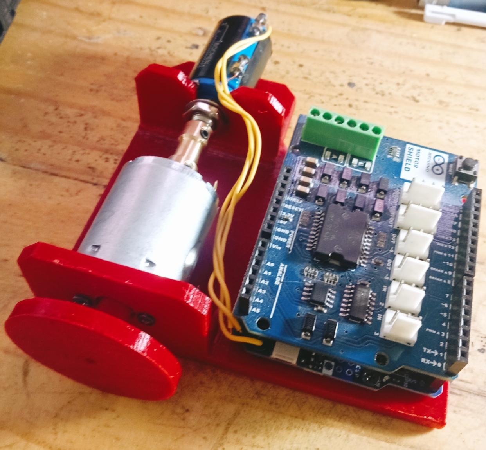
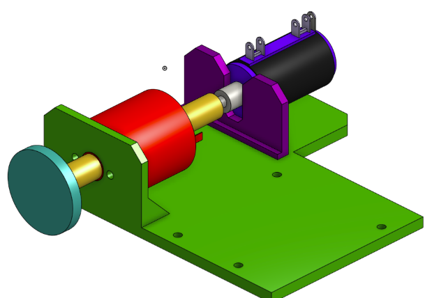
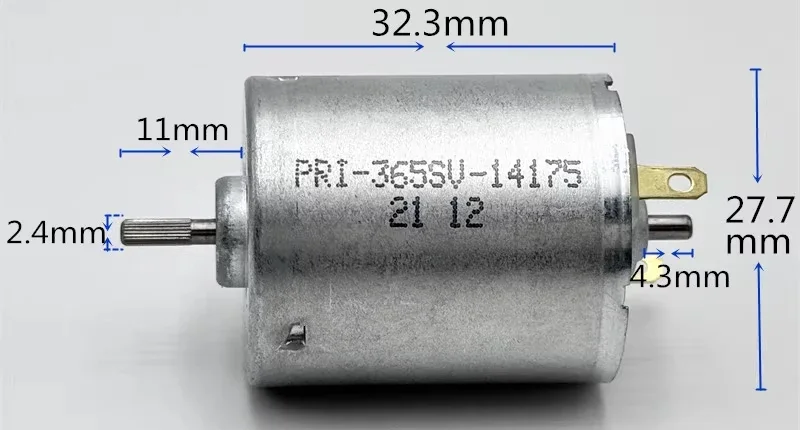

## The Device:

## CAD design:

Designed with ONSHAPE: [external link](https://cad.onshape.com/documents/10bc479726efd397e1b6da2f/w/0b0132ffe39dfe43be7fad69/e/8997c8a6fc3ccb14e4730629)

## Actuation:

RS-365 DC Motor

Information from the seller: voltage/ current / speed at no-load
- 6.0 V, 36 mA, 2450 rpm
- 12.0 V, 45 mA, 5150 rpm
- 14.4 V, 50 mA, 6200 rpm
- 18.0 V, 60 mA, 7850 rpm
- 24.0 V, 95 mA, 10500 rpm

## Sensing:

Bochen multiturn potentiometer (WXD3-13S): Resistance Tolerance ±5% Independent Linearity ±0.3% 

